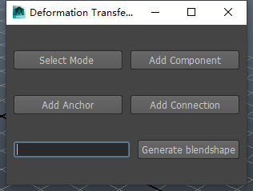
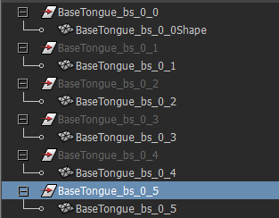
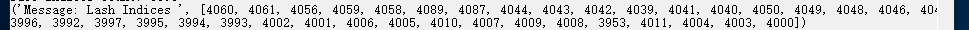
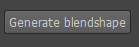
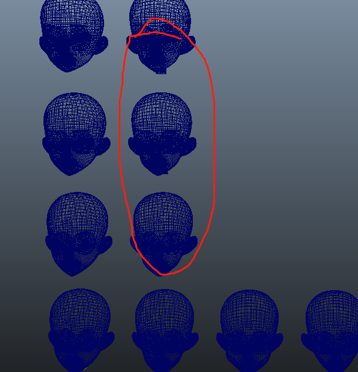

# 使用环境
Maya2014, win10-64
# 安装
## 1.首次使用maya python插件  
(1)运行目录下的.bat将当前路径注册为环境变量(或者手动添加环境变量)，重启电脑。  
(2)将.dll和.cig以及auth.txt(权限认证文件)拷贝至maya的安装目录下的bin文件夹下（例如F://programs/Maya2014/bin 视每台电脑情况也可能为F://programs/Maya2014）  
(3)打开maya，找到插件管理器，加载插件。  
(4)在maya的python终端中输入（脚本编辑器中）：  

```
import maya.cmds as cmds
cmds.MeshDeformer()
```
启动插件.  
## 2.之前使用过python的插件
将目录拷贝至之前放python插件的目录下，其余同2-4。成功运行插件后见下图：  

  

Tip: 脚本编辑器中的命令可以拖动到自定义栏中，以后点击就等同于执行相应的命令，建议将上面两句代码拖到自定义工具栏中，这样不用每次打开工具都需要输入代码。  

# 命名规范
1.不同的部件分别建立一个blendshape，测试用例中head, eye 和eyeBrow各有一个。下面以其中一个blendshape举例，其它的一样。  
2.名称的构成是：名字+下划线+数字1+下划线+数字2(即每个单词之间使用下划线分割)  
3.名字，同一个blendshape下统一命名（纯英文）  
4.数字1由目标脸确定，可以按照目标表情数量依次递增（从1开始）。  
5.数字2由标准脸的46中自然表情确定，按照自然表情数量依次递增（从1开始）。  
6.数字1就是行，数字2就是列，我们的目标就是对于指定的行（目标脸）生成列（46种表情）。  
7._0_0是特殊的标号，表示相应的blendshape中的标准脸的标准表情。    
8.每一个模型的transform节点和mesh节点名称要保持完全相同(<font color = red>作为blendshape基的那个是例外，mesh节点是transform节点名称接上Shape </font>)。参考下图： 

  

9.下面给出一个命名示例：  
<font color = red>Head_bs_0_0 </font>,Head_bs_0_1, Head_bs_0_2,Head_bs_0_3,Head_bs_0_4…Head_bs_0_46 这是自然表情列  
Head_bs_1_0, Head_bs_2_0, Head_bs_3_0, Head_bs_4_0, Head_bs_5_0… Head_bs_34_0 这是捏脸维度的行  

# 使用
1.打开maya bin目录下的config.cig文件,修改模型散布的间隔,第一个数字是宽,第二个是高,可以根据模型大小微调,一般不需要调整。  
2.点击 Select Mode， 进入选择模式  
3.选择某个组件上一点，点击 Add Component 等待输出窗口输出,进行下一步操作(对于眉毛或者牙齿这种需要添加两次，因为它们由两部分组成)。    
4.如果2里面选择的是脸部，并且模型中有睫毛的话，这里要选择睫毛上某一点，点击Add Connect，窗口输出为，注意<font color = red>不要多选</font>，两只睫毛分别添加！！！如果2里面选择的组件是眼球，眉毛，牙齿，舌头等，这里直接跳过。  
5.选择组件上保持不动的点，点击Add Anchor,添加锚点，这里可以多选择几个(<font color = red>如果组件由多部份组成，请每部分至少选择一个锚点 </font>)。  
6.完成后，按f8选择作为基的那个组件(即序号为_0_0)，否则之后的步骤会报错。  
7.在文本框中输入你想生成的“行”，行的概念下面会介绍。然后点击，窗口中会输出进度，maya会卡住，请耐心等待，如果你所有的步骤都完成了，你会得到类似下图的输出：  
  
下面一行模型就是“行”，左侧是列，红圈圈出来的是程序的输出。  
8.生成一行后，不要关闭工具，你可以接着生成下一行，不需要选择点并添加了，你只需要输入想要的行，点击生成，<font color = red>如果你什么都不填直接生成，会默认生成所有行，如果你的行很多，可能会卡很久</font>，所以请谨慎填写。（当然关闭工具一切清零，需要从步骤1重新开始）。  
9.当一个组件的所有行都生成完成之后，关闭工具，重新打开，重复上述步骤，直到生成所有组件。  
10.生成完成之后，某些组件的位置可能需要微调。  

# 错误简表

| 错误输出 | 含义 |
| :------| :------: |
| invaild input | 文本框的输入是非法的，请输入纯数字 |
| nan or inf input | 输入的mesh顶点数据非法 |
| illegal or  trivial triangles | 输入的mesh顶点索引有问题 |
| nan of inf in E1Mat | 程序内部问题 |
| not initialized when transfer | 程序内部问题 |
| vertex size not matched | mesh的拓扑不同 |
| nan or inf in srcVertsDeformed | 输入的mesh有非法数据 |
| nan or inf in result | 运算结果有问题，可能有重合的顶点或者是其他未知问题 |
| failed, code xxx | 程序内部问题 |
| please select blendshape mesh!!! | 请在运算前选择参考mesh |
| dll not found, please check install doc!!! | 检查dll是否正确拷贝 |
| no component connect finded | 检查正确指定了连接关系 |
| load auth bundle failed | 没有将权限认证文件拷贝到指定位置 |
| auth failed | 权限认证失败（请使用有效证书，并重启maya） |

工具在生成到一半的时候停止，多半是模型命名不符合规范，请检查模型的命名。

# 辅助插件使用指南

### 1.重命名插件Rename.py

这是一个批量重命名工具，主要针对命名不符合bs生成插件命名规范的模型，可以批量规范命名。

1.首先同样的，使用插件管理器加载插件。

2.在大纲视图中选中想要批量重新命名的模型名称

3.在脚本编辑器中输入类似下列代码：

`import maya.cmds as cmds`

`cmds.Rename( d = 0, s = 10, p = "Head_bs")`

4.参数含义：

此插件会根据p,d,s的值对选定模型重命名，命名格式为p的值加上“_row_col”，示例代码中即为 Head_bs_xx_xx。

s 代表命名起始的序号，这里10代表之后的名称会从10开始依次加1。

d 代表重命名的是行还是列, 1代表行，0代表列，1意味着模型序号会是:"10_0", "11_0", "12_0"..... 0意味着"0_10","0_11","0_12"...

### 2.模型优化插件optimize.py

这是一个最终发布包大小的工具，对于程序生成的模型来说，每一个bs模型会有及其细微的差异，导致压缩后的包大小比手工制作的bs模型大。

此插件利用合理的阈值抹去细微差异从而达到优化包大小的目的，阈值越大，生成的包体积越小，但是，过大的阈值会导致失真甚至错误的结果。

以下为使用指南：

1.还是同样的，首先使用插件管理器加载插件。

2.阈值选取：

针对除脸部以外的模型来说，可以直接选取阈值为0.000001（这是一个经验值），如果效果不理想可以先看一下数据分布再重新选取阈值。

数据分布的查看：

`import maya.cmds as cmds`

`cmds.optimize(f = 0, bc = 46, p = "Head_bs", t = 0.1, s = 0, e = 0)`

bc 为自然表情数量，p 为模型名称前缀， t 为想要查看的数据区域，其他参数不变。

执行之后，程序会打印每一个表情相对于标准表情的变化量的分布情况，有10个区间，第一个区间为相对原位置，变化小于 0.1 * t的点的数量， 第二个区间为 大于0.1 * t 小于0.2 * t的点的数量，第三个区间为大于0.2 * t 小于 0.3 * t的点的数量...第十个为变化量大于t的点的数量。通过这些数据，我们可以了解真正的表情变化量大致为多少，那么小于这个变化量的，我们可以认为是程序带来的误差，所以可以将阈值定为这个值。

3.自然表情和捏脸维度的源数据优化

如果自然表情和捏脸的模型都是手工制作的话，那么不需要经过这一步优化，如果不是，则需要工具优化，在进行下一步。

对于自然表情的优化，请设置参数f 为1，bc为自然表情数量，p为想要优化部件的前缀，t为合适的值，即可

对于捏脸维度的源数据优化，设置f为2，p为想要优化部件的前缀，e为捏脸维度数量，t为合适的阈值，即可

4.程序生成bs的优化，

设置f为3，bc为自然表情数量， p为想要优化部件的前缀，t为合适的阈值，s为想要优化的维度的起始序号，e为想要优化的维度的终止序号，s = 1, e = 12表示我想优化从1到12的捏脸维度数据，

这里设置一个区间是为了放便保存，如果一次性优化过多的维度，maya可能会崩溃。可以从上一次保存的结果继续。

